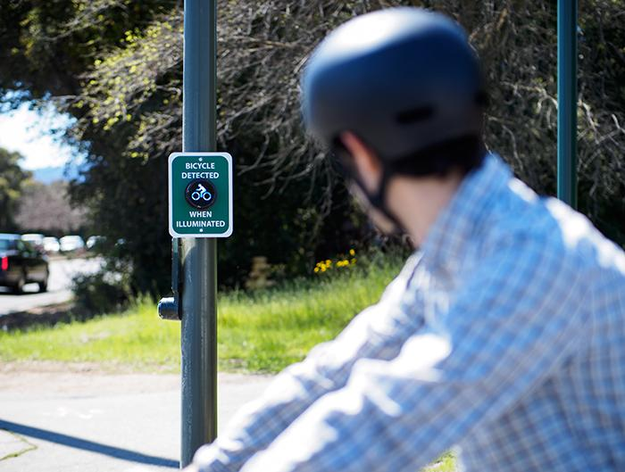

### Types of Loop Sensors
- There are 3 types:
   - car-activated
      - large square
      - bikes can only activate by situating bike over right edge
      - doesn't work well for lighter bikes (e.g., carbon-fiber)
   - bike-activated
      - two-smaller loops
      - bike symbol - bike places wheels on two lines in front and behind bike symbol
   - dual-activated (both car and bike)
      - large square with center "filled"
      - bike places in center of square

### Loop Sensors in the Bay Area
- Santa Clara - doesn't use push buttons
- Mountain View - loops sensors break and it's difficult to check if they are; the only way is through community feedback
- San Jose 
   - the bike symbol indicating a bike sensor is misleading as it was unintentionally used at intersections where there weren't any sensors
   - most progressive in Bay Area in terms of bike signal/sensor technology

### Trends in sensors
- Video sensors
   - touchless
   - easier to debug, fix
- Blue lights 
   - to provide user feedback of sensor activation
   - examples:
      - Portland: 
           - https://www.portlandoregon.gov/transportation/article/660377
           - https://bikeportland.org/2019/10/11/new-blue-light-for-bike-riders-part-of-detection-research-project-306124
     

### Technology
- [iTeris](https://www.iteris.com/products/pedestrian-and-cyclist/smartcycle)
     
